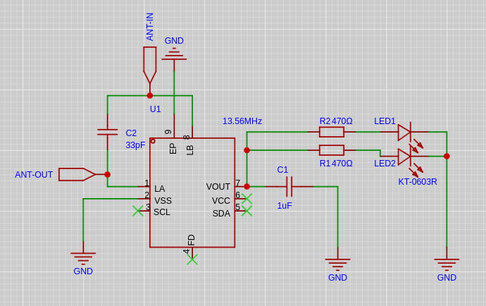
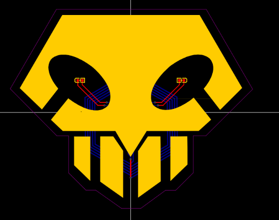
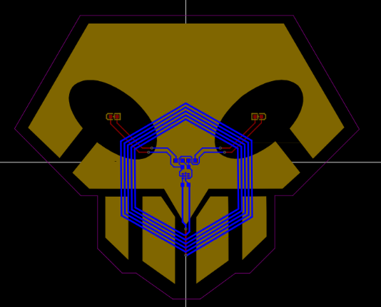
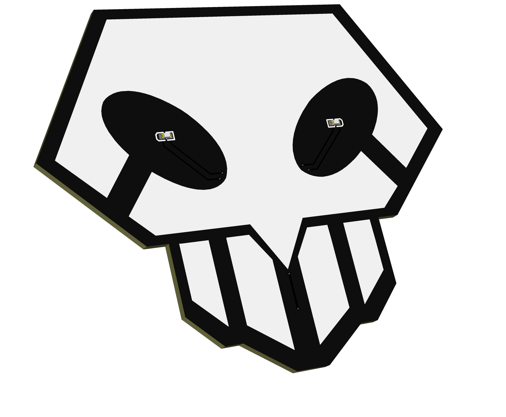
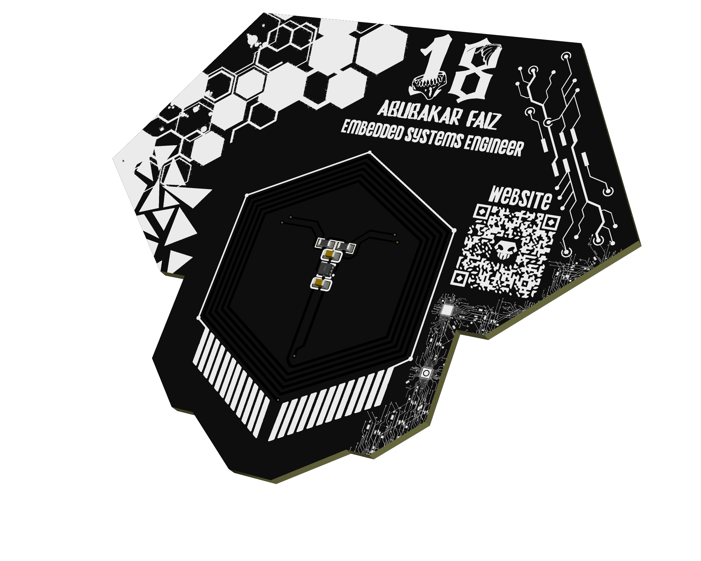

# FullBringer: A PCB Business/Portfolio/ID Card with NFC and Design Inspired by Bleach

## 29-08-2026

### FullBringer: Born

I wanted to make a cool looking PCB Card which has NFC, this way i would be able to work with NFC and learn how it works, and the theme for the pcb would be Bleach's Fullbring, Its a Card type item Ichigo Uses to transform and gain powers of Fullbringers. So this was the Perfect project to get Hours and still being fun and Practical instead of A.i Slop. Since I needed the Best NFC Chip, I chose to go with **NT3H1101W0FHKH**, because it has the capability of transmitting somewhat larger data (~1000 bytes), so I could use it for anything basically, like showing a link when Scanned, or sending a message with my number saved, this would be really helpfull for:

- Networking
- Looking Cool
- Impressing Recruiters

Hence with all these benefits, i had to build this thing. I First Started with getting the Board Outline right, and I did that by importing the Fullbring picture into Inkscape (you can also use any vector based software), then i used the pen tool to outline the shape, After that I exported only the vector shape into .dxf format. and then I uploaded that into EasyEDA by using the Import option and selecting DXF file. I had some problems like not getting the dimensions correct, like for example, the board outline was like 27inch lol, if i hadn't noticed it would've been a problem, well after fixing that it was pretty easy, i had to work on the Schematic First.

My Plan was to use the NFC Chip to power the LED's inside the Eye Shape, and using a Red LED is the best option because it requires the lease amount to current to lit up (1.8V-2V), which the NFC chip can provide just from the Phones RF signals. I also needed to add resistors and capacitors to everything. The Most Important being the Antenna.

The Antenna is the Main thing of an NFC Device, the bigger it is the better the scannability, so I had to make it bigger and Hexagonal Shape.

We have to Calculate the Frequency and Use the Most compatible Tuning Capacitor in order to get 13.56MHz, and thats a bit of math, you have to use a website and add the details of your Exact Shape like how many turns the coil have and inner/outter diameter. Well After Calculating that, the entire circuit is pretty easy. and after wiring everything this is how it looks:

Schematics:

PCB:

The wiring turned out so Peak. 

[Lapse-Recording](https://lapse.hackclub.com/timelapse/x4mbCJO4-PNi)

## 30-08-2026 to 31-08-2026

### Finishing the Design:

These days I worked on the Design of the Card. I was going for the Cyberpunk/Bleach Aesthetic, so I looked up stuff on pinterest etc and imported stuff I liked. Art is a Part of Me, I can't just let it be Bland. Its Hard to Explain the Design aspect so let me just show you how it looks:

I'm Very Proud of the Design, This was a pretty Easy and Fun Project, maybe I'll make something like this again but with a different Design. That's it for this Project.

[Lapse-Recording](https://lapse.hackclub.com/timelapse/lwEcdGAcOBfR)
[Lapse-Recording](https://lapse.hackclub.com/timelapse/QgyZu3c77ZgE)

//***See you Space Cowboy***

